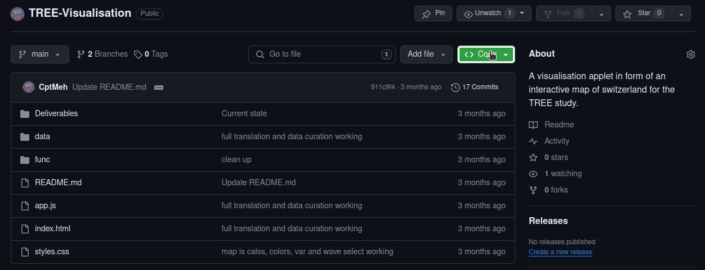
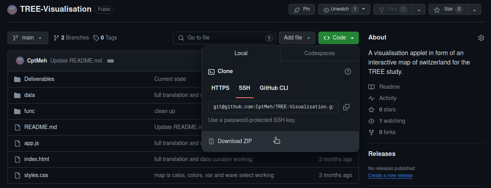
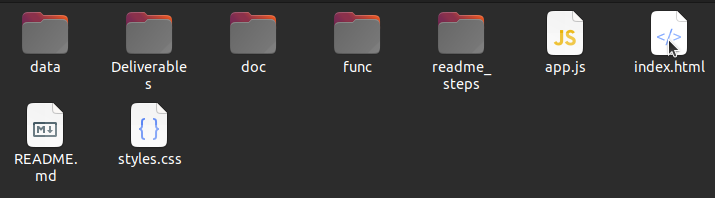

# TREE-Visualisation
A visualisation applet in form of an interactive map of switzerland for the TREE study. 

# Beginners Guide fpr running the applet on your PC
This is a guide on how to open and look at the Visualisation for people who are unfamilliar with GitHub and programming.

### Step 1: Download the files
Click the code button and download the .zip folder.

### Step 2: Unpack the .zip file
Go to your downloads and find the downloaded "TREE-Visualisation-main.zip" file. Rightclick the file and select "Extract".

### Step 3: Run the HTML File
Go inside the folder extracted folder and double-click the file named "index.html". This should start up the visualisation.

